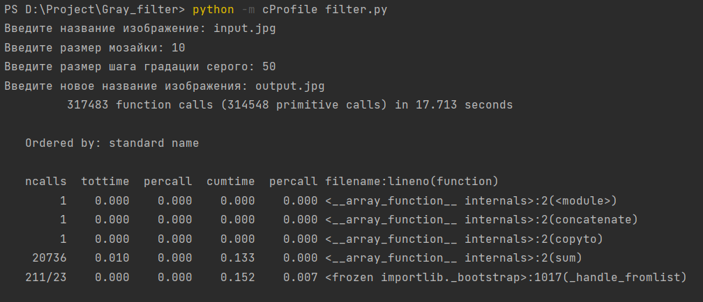
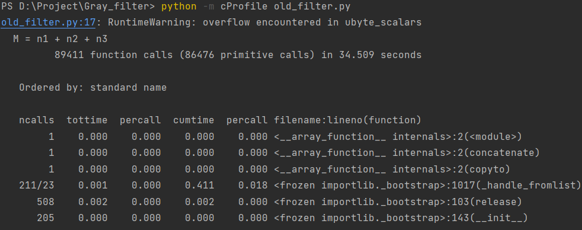
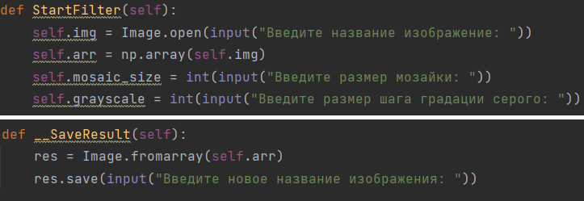
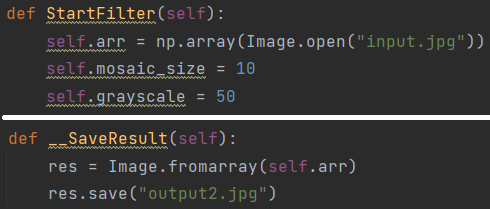
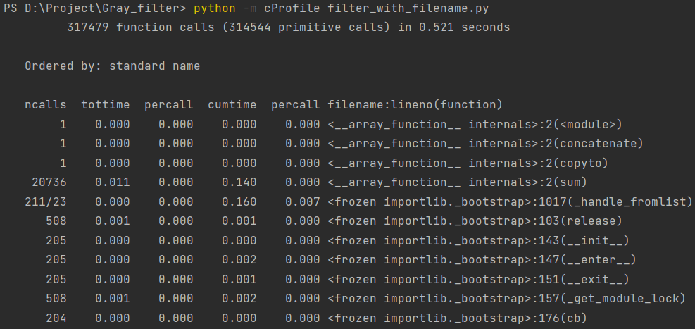
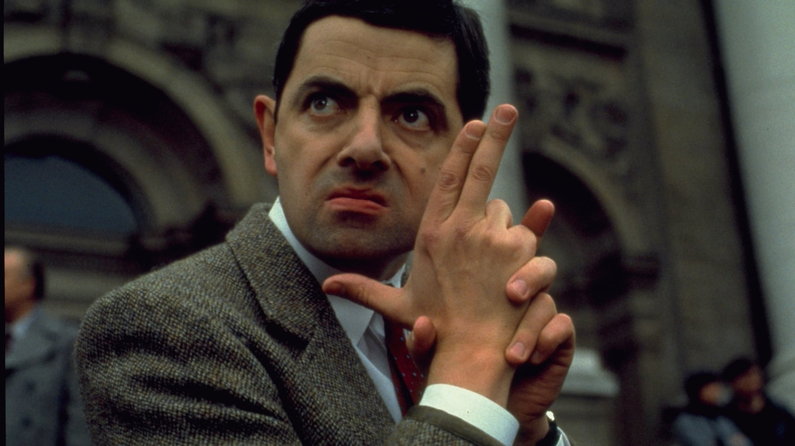
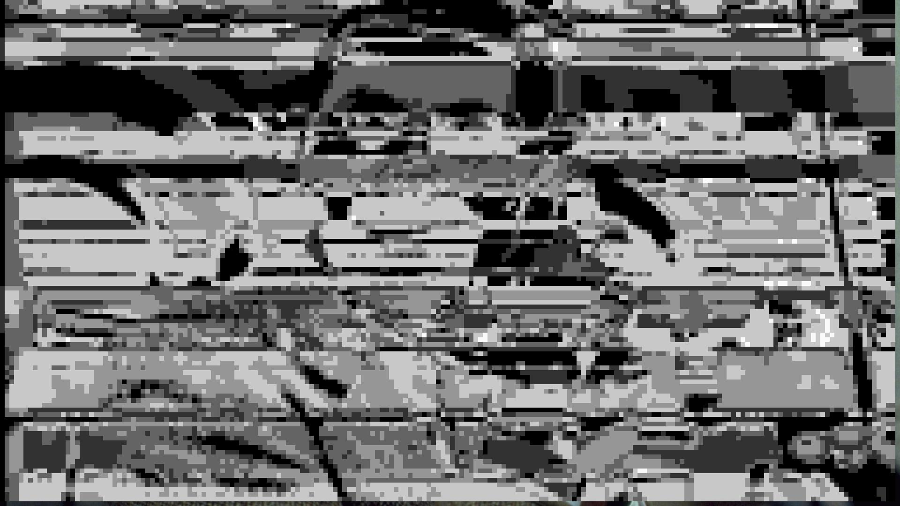
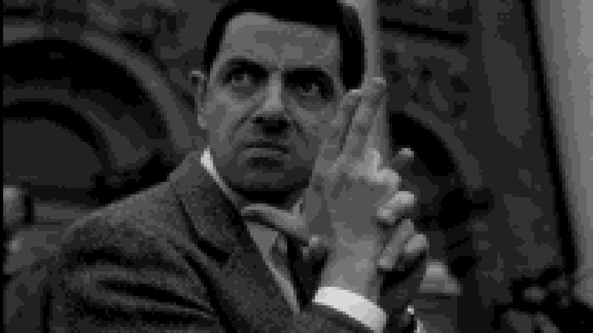
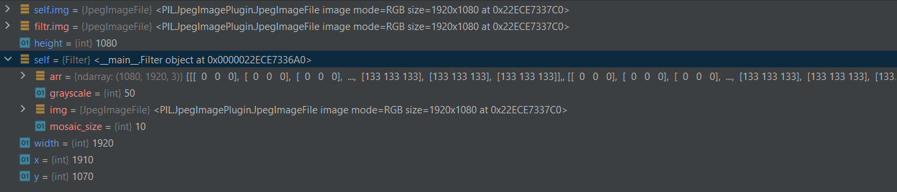
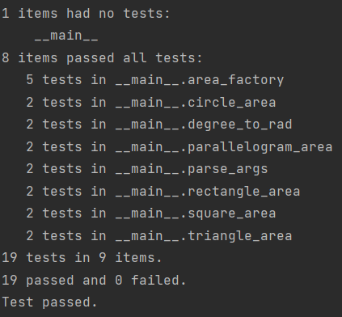

# Gray_filter
Результат работы профилирования filter.py - 17.713 сек.

Результат профилирования old_filter.py – 37.509 сек.

Несмотря на большее количество вызовов у нового фильтра, чем у строго, работает он быстрее.

Создадим новый файл filter_with_filename.py, в котором сразу в коде укажем имена файлов исходного и результирующего,
а также размер сетки 10 и количество градаций серого 50. После проверим его время выполнения.

До преоброзований в filter.py:

После преобразований в filter_with_filename.py, избавлены от консольного ввода:

Результат работы профилирования filter_with_filename.py - 0.521 сек. 

Тестовое изображение:

Результат работы изначального фильтра old_filter.py:

Результат работы фильтра filter.py (размер сетки - 10, количество градаций серого - 50):

Результат работы фильтра filter_with_filename.py (размер сетки - 10, количество градаций серого - 50):

Через отладчик можно вывести все необходиммые свойства изображения и параметров:

Doctest
Работу с doctest была реализована в файле "paint-doctest.py", так как в дрйгих файлах репозитория реализация проблематична. Результаты выполнения ниже:

